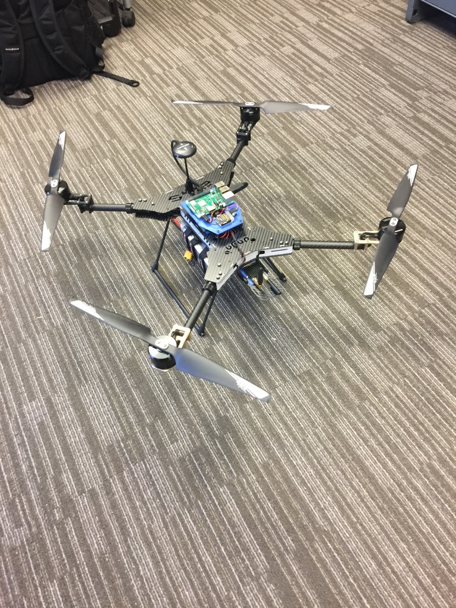

# ND Classroom Drone
This repo contains core information regarding the design and construction of a quadrocopter intended for use in undergradtuate teaching environments.  As such it represents an associated balance between cost, performance, ease of assembly, and configurablity for student design exercises.

## Basic specs
- Quadracopter with an onboard Raspberry Pi
- Cost: $1400 (Excludes parts shipping, a bag, and assumes you have a compatable transmitter and 4S LiPo battery charger) 
- Built around the Pixhawk4 Autopilot running PX4
- Take-off weight including Pi: 3100g
- Payload capacity: 500g
- Flight Time with no additional payload: 30min+
- Assembly and test flight time: 16hrs (once experienced)

## Getting started

Note: Some basic tools including a means of printing in ABS or PLA are required for assembly.  All 3D printable models are available in [3dmodels](./3d_models) as FreeCad design files and stl files

All required components and suppliers are listed in the following [BOM](https://docs.google.com/spreadsheets/d/1iEDaoHABfFCszNGsnZw02dHB14kcI-Gh68_Vd7EEHdI/edit#gid=1882978022) (Correct as of September 2019)

Build instructions are available [here](./build_instructions/README.md)

## Contributing
If you use our design please do get in contact and let us know. CRCsupport@nd.edu

If you make an improvement pull requests are also welcome.
