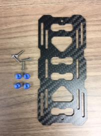
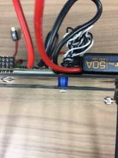
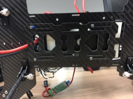

Battery Tray
==

Parts
--

1. Gather the necessary parts. Four (4) printed [spacers](../../3d_models/battery_mount_washer/battery_mount_washer.stl) are required.\

Assembly
--

1. Secure the tray to the underside of the body. The spacers will go between the tray and the body to create space for the battery cable to exit.\
\
1. Make sure that battery connector exits the rear between the battery tray and the body.\

