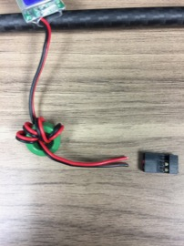
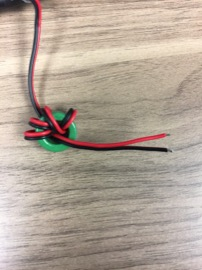
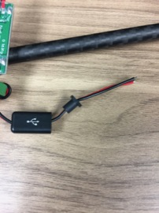
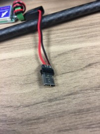
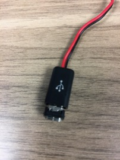
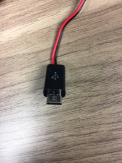

Battery Elimination Circuit
==

The BEC supplies 5V at 3A to the Raspberry Pi from the primary batteries

Required Parts
--

- (1) ESCs
- (1) Micro USB Solder connector
- Double-Sided Foam Tape

Required Tools
--

- Wire Cutters
- Wire Strippers
- Soldering Iron
- Solder

Micro USB Connector
--

1. Cut off the connector from the end of BEC output wires (as close to the connector as possible).\
  
1. Strip a small amount of wire and tin with solder.\
  
1. Slide the connector cover and strain relieve onto the wires.\
  
1. Solder the BEC output wires to the outer two of the three top solder pads of the connector as shown below.\
  
1. Slide the connector cover over the strain relief and onto the connector.
1. Slide the front plate of the connector over the micro usb plug and into the connector cover.\
  
  
