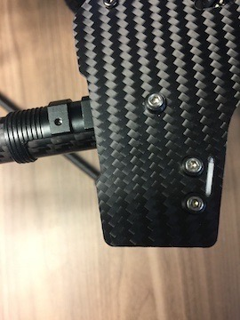
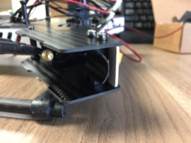

Body Disassembly
==

Motor Arms
--

1. Remove one (1) motor arm pivot screw from the top of the body for each motor arm using a 2mm hex wrench.\
  
2. Remove motor arm.

Motor Arm Seat
--
1. Remove two (2) screws securing motor arm seat using a 2mm hex wrench.\

1. Remove motor arm seat.

Body Top Plate
--
1. Remove twelve (12) screws from top of body.
1. Separate the top plate from the bottom plate.
