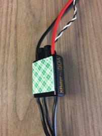
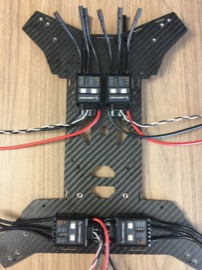

Electronic Speed Controllers.
==

Required Parts
--

- (4) ESCs
- Double-Sided Foam Tape

Mount ESCs
--

1. Apply double-sided foam tape to the back of each ESC.\
  
1. Install the ESCs as shown below.
  - The rear ESCs should be set in slightly so that they do not interfere with the rear plate of the body.
  - The rear ESCs should be set back enough that they do not interfere with the screw holes in the bottom of the body.
  - The rear ESCs should be centered in the body side-to-side with only a slight gap between them.
  - The front ESCs should be positioned up agains the rear of the front platform mounting arms.
  - The front ESCs should be spaced closely enough together that the do not interfere with the screw holes in the bottom of the body.
  
1. Set the switch positions on the ESC to the following:
  - Front, Right
    - LED: Off
    - DEO: Off
    - Color: Doesn't Matter
    - Rotation: CCW
  - Rear, Right
    - LED: On
    - Color: Green
    - DEO: Off
    - Rotation: CW
  - Rear, Left
    - LED: On
    - Color: Red
    - DEO: Off
    - Rotation: CCW
  - Front, Left
    - LED: Off
    - Color: Doesn't Matter
    - DEO: Off
    - Rotation: CW
