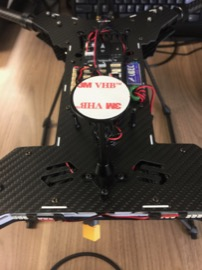
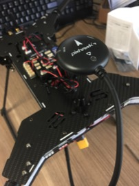

GPS
==

Required Parts
--

- (1) GPS Unit
- (1) Double-Sided Mounting Disc

Mount GPS
--

1. Adhere the mounting disc to the top of the gps platform.\

1. Secure the gps unit to the platform.
  - Make sure that the arrow on the gps is pointing towards the front of the vehicle.\
  
