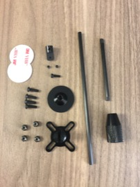
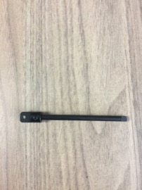
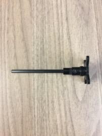
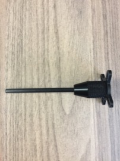
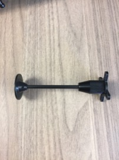
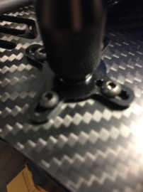

GPS Mast
==

Required Parts
--

- The parts below are required with the exception of the longer mast and the double-sided discs. They will be used later.\

Required Tools
--

- 1.5mm Hex Wrench
- 2mm Hex Wrench
- Nut driver or wrench

Assemble Mast
--

1. Secure the pivot to the mast using a small screw and a 1.5mm hex wrench.\

1. Attach the pivot to the base using a screw and a 2mm hex wrench.\

1. Slide the knurled locking nut over the mast and secure it to the base.\

1. Attach the gps platform to the top of the mast using a screw and a 1.5mm hex wrench.\

Mount Mast
--

1. Secure the gps mast assembly to the rear of the top of the drone body with 4 screws and nuts.\

