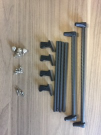
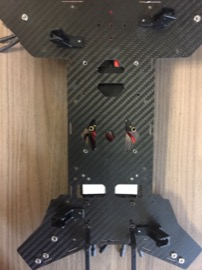
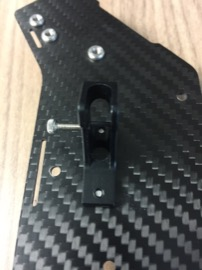
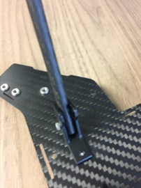
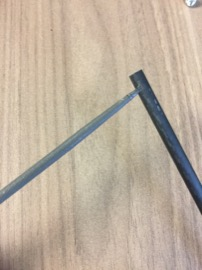
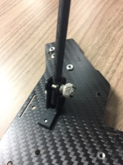
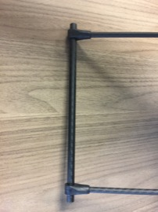

Landing Gear
==

1. Locate landing gear parts.\

1. Attach landing gear mounts to bottom of body using the small screws.\

1. Thread the long screws into the side of the landing gear mounts. These screws will form the pivot for the foldable gear.\

1. Attach landing gear legs by screwing the pivot screw through the opening in the leg.\
\
You may need to ream out the hole slightly using a round file if the screw does not fit through it.\

1. Install thumb screws into sides of landing gear mounts. These screws are used to lock the folding gear into position.\

1. Attach the landing gear feet by sliding them into the landing gear legs. The connectors will need to be adjusted inward to line up with the legs.\

