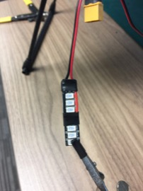

Rear LEDs
==

Required Parts
--

- (1) Green LED Strip
- (1) Red LED Strip
- Red/Black Wire
- Double-Sided Foam Tape

Required Tools
--

- Wire Cutters
- Wire Strippers
- Soldering Iron
- Solder
- Shrink Tubing
- Heat Gun

LED Strips
--

1. Each strip of LEDs contains 4 separate sections. We will be using 2 sections, so snap one strip in half and save the other half for another drone.\
  
  
1. Solder a piece of red wire to the "+" pad of the center of the LED strip, and a piece of black wire to the "-" pad.\
  
1. Cut the red and black wires so that they are just long enough to reach the outer pad of the other LED bank.\
  
1. Strip the red and black wires slightly and tin with solder.\
  
1. Solder the red and black wires to the pad of the other LED bank.\
  
1. Over the center pads with shrink tube.\
  
  
1. Solder LED wires from Power Distribution Board to the pads of the LED strips. Cover with shrink tube.\
  
  
1. Secure the LED strips the rear of the drone body using double-sided foam tape.
  - The red LED strip goes on the left side (as viewed from the back).
  - The green LED strip goes on the right side.\
  
