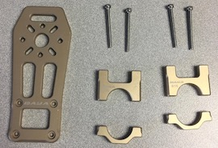
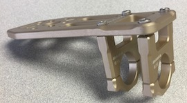
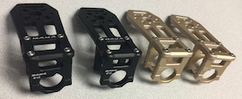
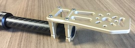
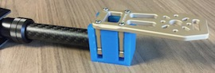

Install Motor Mounts
==

Required Parts
--

- (4) Motor Mount Platforms
- (8) Motor Mount Brackets
- (4) [Motor Mount Alignment Tools](../../3d_models/motor_mount_alignment_tool/daya_680_motor_mount_tool.stl)

Assemble Mounts
--

1. Disassemble two (2) Motor Mount Brackets.\
  
1. Install the Motor Mount Brackets on the Motor Mount Platform using a 2.0mm hex wrench.
  - The Motor Mount Platform has a top and bottom, so make sure that the bolt heads seat into the pockets on the Platform.
  - Leave the bolts slightly loose so that the assembly will slip onto the tubes later.\
  
1. Repeat for all four (4) Motor Mounts.\
  

Install Mounts Onto Frame
--

- NOTE: The gold Motor Mounts should be mounted to the front tubes and the black Motor Mounts should be installed to the rear tubes. The front of the frame is narrower than the rear and has the word "daya" cut into the top frame piece.

1. Slide the Motor Mounts onto a tubes of the frame.\
  
1. Use an alignment tool located [here](../../3d_models/motor_mount_alignment_tool/daya_680_motor_mount_tool.stl) to ensure that the Motor Mounts are installed level.
  - Lay the frame on a flat surface.
  - Slide the Motor Mount Brackets into the slots of the alignment tools.\
  
  - Make sure that the frame tube is inserted all the way into the alignment tool.
  - Ensure that the Motor Mount Platform rests flat on top of the alignment tool.
  - Tighten the mounting screws.
