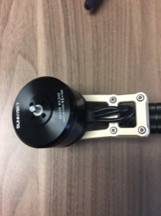
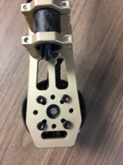
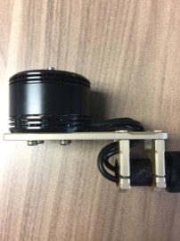
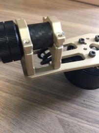
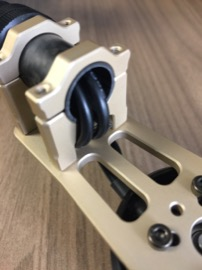

Motors
==

Required Parts
--

- (4) Motors
- (16) Mounting Screws

Required Tools
--

- 2.5mm Hex Wrench

Mount Propellers
--

1. The motors should be mounted to the motor mounts such that the wires are facing towards the motor arms.\
  
1. Secure the motors to the motor mounts using the supplied mounting screws and a 2.5mm hex wrench.\
  
1. Route the motor wires through the motor mount.\
  
  
1. Push the motor wires through the motor arm.\
  
