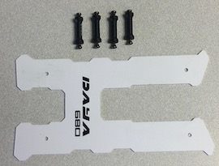
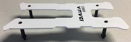

Install Top Platform
==

Required Parts
--

- (1) Platform
- (4) Standoffs
- (8) Screws

Essembly
--

1. Attach standoffs to platform using 2.0mm hex wrench. Ensure that the head of the screw is flush with the platform.\
  
1.
