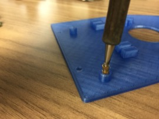

Install Top Platform
==

Required Parts
--

- (1) [Printed Platform](../../3d_models/top_mounting_plate/top_mounting_plate.stl)
- (1) Raspberry Pi
- (4) Nylon Screws for Raspberry Pi
- (1) Receiver
- (4) Threaded Inserts
- (1) USB Telemetry Cable
- Double-Sided Foam Tape

Threaded Inserts
--

1. Insert threaded inserts into the mounting platforms.
  - Place an insert on top of the platform.\
  
  - Use a narrow-tipped soldering iron set at 200 degrees C to press the insert into the hole.\
  
  - Use steady force and press the insert straight down until the insert is flush with the top of the platform.\
  
  - Repeat for the other three inserts.\
  

Receiver
--

1. Attach the receiver to the narrow end of the platform using double-sided tape as show below.
  - Ensure that the receiver cable does not interfere with the [printed cover](../../3d_models/top_mounting_plate/top_mounting_plate_lid.stl) that will be added later.\
  
1. Route the receiver antennas through the guides so that they exit the rear of the platform.\

Raspberry Pi
--

1. Secure the Raspberry Pi to the platform using 4 nylon screws.\
  

Mounting the Platform
--

1. Plug the USB telemetry cable into the "Telem 2" port of the PX4.
1. Route the receiver cable through the hole of the platform and connect to the "PPM RC" port of the PX4.
1. Route the micro USB cable from the BEC through the bottom of the platform and plug it into the Pi.
1. Secure the platform to the standoffs using 4 screws.
  - The narrow end of the platform will face the front of the vehicle.
1. Plug the USB telemetry cable into the Raspberry Pi.\

