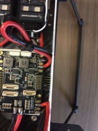

Power Distribution Board
==

Required Parts
--
- Power Distribution Board
- BEC
- Red/Black Wire for Rear LEDs
- Double-Sided Foam Tape

Required Tools
--
- Wire Cutters
- Wire Strippers
- Solder Iron
- Solder

ESC Wiring
--
1. Cut ESC input wires to length. They should reach their solder pads on the power distribution board (PDB) but still have some slack.
1. Solder the ESC input wires to the pads on the power distribution board.
  - There are 4 sets of pads on the corners of the PDB.
  - The black wires will be soldered to the pads labeled "GND" and the red wires will be soldered to the pads labeled "B+".
  - NOTE: Ensure that the PWR1 and PWR2 connectors are towards the front of the body.\

1. The control wires from the ESC will attach to the side of the PDB.
  - Plug the cables into the header labeled "FMU-PWM-out".\
  \
  - The white wire will be facing up if the connector is installed correctly.
  - The header is labeled 1 at one end and 8 on the other.
  - Install the plugs in the following order from 1-4:
    1. Front, Right
    2. Rear, Left
    3. Front, Left
    4. Rear, Right\
    

BEC Wiring
--
1. Connect the BEC to the PDB.
  - Solder the wires from the input side of the BEC to the spare set of GND/B+ pads on the front, right corner of the PDB.
  - The black wire will connect to "GND".
  - The red wire will connect to "B+".\

LED Wiring
--
1. Connect two (2) sets of wires to the PDB for the rear LEDs.
  - Each set should be long enough to exit the rear of the drone and still have a few inches of wire exposed to allow for easy soldering of the LED boards later.
  - Solder the wires to the spare sets of GND/B+ pads on the rear of the PDB.
  - The black wires will connect to "GND".
  - The red wires will connect to "B+".
1. The connections on the PDB should now look like this:\

Secure PDB to Body
--
1. Apply double-sided foam tape to rear of PDB.
  - Avoid placing tape over and extruding pins.\
  
1. Apply a second layer of foam tape to cover entire back surface.\
  
1. Attach the PDB to the body.
  - The battery connector will exit the rear of the body.
  - Ensure that the PDB is positioned such that both sides of the drone body can be reinstalled later.\
  \
  

PDB / PX4 Cables
--
1. Connect the following PX4 cables to the PDB:
  1. PWR1
  1. PWR2
  1. FMU-PWM-in
