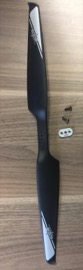
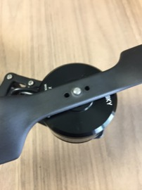
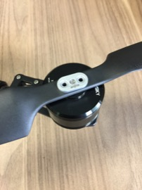
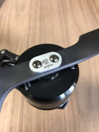

Propellers
==

Required Parts
--

- (2) CW Propellers
- (2) CCW Propellers
- (4) Mounting Plates
- (8) Mounting Screws

Required Tools
--

- 2mm Hex Wrench

Mount Propellers
--

1. Propellers should be installed in the following orientation:
  - Front, Right
    - CCW
  - Rear, Right
    - CW
  - Rear, Left
    - CCW
  - Front, Left
    - CW
1. Each propeller will be installed using one (1) mounting plate and two (2) screws.\
  
1. Place the appropriate propeller over the shaft of the motor.\
  
1. Place the mounting plate over the shaft and align screw holes with the holes in the propeller.\
  
1. Insert mounting screws through the mounting plate and propeller.\
  
1. Secure the mounting screws into the threaded holes of the motor using a 2mm hex wrench.\
  
