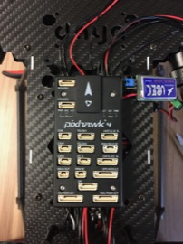

Pixhawk 4
==

Required Parts
--

- (1) Pixhawk 4 (PX4)
- (1) SD Card
- (4) Foam Mounting Pads
- (1) I2C Bus
- Pixhawk Cables

Mount PX4
--

1. Insert SD card into the back of the PX4 until it clicks into place.
  - The pins of the card will face upwards as shown below.
  - The card is spring loaded, so press inward to remove the old one if necessary.\
  
1. Apply foam mounting pads to back of PX4 as shown below. The placement of the pads should help to maximize the amount of pad that will be in contact with the drone body.\
  
1. Secure the PX4 to the top of the drone body.
  - Ensure that the PX4 will not interfere with the standoffs for the plate that will be installed above the PX4.
  - Make sure that the cables from the Power Distribution Board are able to reach their ports on the PX4.
  - The BEC should exit from underneath the right side, front of the PX4.
  - The arrow on top of the PX4 must be pointing towards the front of the vehicle.\
  
1. Use double sided foam tape to secure the BEC next to the PX4.\

  - The output wires of the BEC should face the rear of the vehicle.\
  
1. Use double sided foam tape to secure the I2C board next to the PX4.
  - Make sure that the board does not interfere with the USB plug on the side of the PX4.\
  
