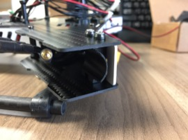

Body Reassembly
==

Required Parts
--

- (4) Standoffs
- (8) Screws for Standoffs
- Body Bottom Plate
- Body Top Plate
- Body Side Plates
- (12) Body Screws

General Checks
--

1. Ensure that all screws that will be on the interior of the body are tight. Once assembled, they will not be accessible again.

Top Platform Standoffs
--

2. Install the top platform Standoffs to the top of the body using screws if they are not already installed.\

Assemble Body
--

3. Set the white body front, rear and side plates into the slots of the lower body plate.\

4. Pass the rear LED red and black wires through the center hole of the rear plate.
5. Place the top body plate onto the body.
   - Pass the BEC and Power Distribution Board cables through the openings of the upper body plate as show below.
   - Make sure to align the slide the front, rear and slide plate tabs.\

6. Screw the upper body plate to the lower body plate.
   - Make sure not to pinch any wires between the body plate and the standoffs.\

Install Motor Arms
--

7. Install motor arm seats using the 2 screws and washers removed earlier.\

8. Insert the motor arms and secure with the pivot screws removed earlier.
