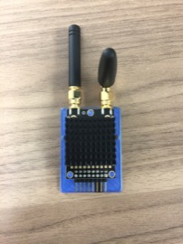
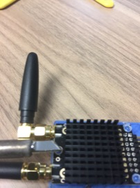
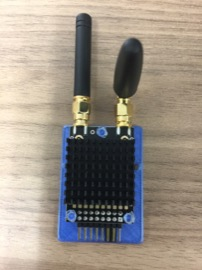
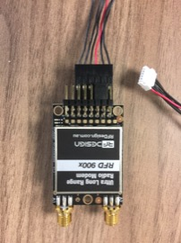
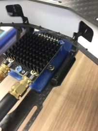
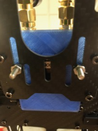
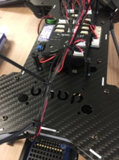

Telemetry Radio
==

Required Parts
--

- (1) Telemetry Radio
- (2) Telemetry Radio Antennas
- (1) Telemetry Radio Cable
- (1) [Printed Telemetry Radio Tray](../../3d_models/telem_radio_mount/telem_radio_mount.stl)
- (2) Screws
- (2) Nuts
- (2) Small Zip Ties

Mount Telemety Radio
--

1. Attach the antennas to the telemetry radio.
1. Place the telemetry radio onto the radio tray.\

1. Use a wide-tipped soldering iron set at 200 degrees C to flatten the posts of the tray to secure the telemetry radio.\
\

1. Attach the telemetry radio cable in the orientation shown below.\

1. Secure the telemetry radio assembly to the radio platform using 2 screws and nuts.\
\

1. Plug the telemetry radio cable into the "Telem1" port of the PX4.
1. Use zip ties to secure the wires into a bundle.\

