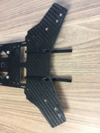
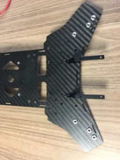
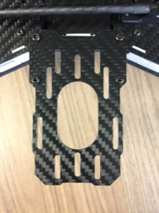

Telemetry Radio Tray
==

Required Parts
--

- (2) Tray Mounting Brackets
- (1) Tray
- (8) Mounting Screws

Required Tools
--

- 2mm Hex Wrench

Mount Tray
--

1. Insert the tray mounting brackets into the slots in the front of the bottom frame plate.\
  
1. Secure the tray mounting brackets with the screws using a 2mm hex wrench.\
  
1. Attach the tray to the tray brackets using 4 screws and a 2mm hex wrench.\
  
